# Multi-Network Policies Demo with KubeVirt on OpenShift

**multi-network policy enforcement** using KubeVirt VMs with multiple network interfaces on OpenShift, managed through **ArgoCD GitOps**.

- **Fedora VM** with dual NICs (pod network + br-ex-network)
- **SSH access control** - allowed on pod network, blocked on br-ex network
- **Network segmentation** with service-specific policies per interface
- **GitOps deployment** via ArgoCD

```mermaid
graph TD
    subgraph CLUSTER["🏢 OpenShift Cluster"]
        subgraph NS["📦 multi-network-demo Namespace"]
            
            subgraph VM_GROUP["🖥️ Fedora VM"]
                VM[fedora-dual-nic-vm<br/>💻 2 CPU, 4GB RAM]
                VM --- NIC1[eth0<br/>🔗 Pod Network<br/>10.244.x.x]
                VM --- NIC2[eth1<br/>🌉 br-ex Network<br/>192.168.x.x]
            end
            
            VM_GROUP ~~~ CLIENT_GROUP
            
            subgraph CLIENT_GROUP["👥 Test Clients"]
                CLIENT1[test-client-pod<br/>📱 Single NIC<br/>🔗 10.244.x.x]
                CLIENT2[test-client-dual-nic<br/>📱 Dual NIC<br/>🔗 10.244.x.x + 🌉 192.168.x.x]
            end
            
            CLIENT_GROUP ~~~ POLICY_GROUP
            
            subgraph POLICY_GROUP["🛡️ Network Policies"]
                PODPOL[Pod Network Policy<br/>✅ SSH from test clients<br/>🚫 Other traffic denied]
                BREXPOL[br-ex MultiNetworkPolicy<br/>🚫 SSH completely blocked<br/>✅ HTTP/DNS only]
            end
        end
    end
    
    %% SSH Success Flows (Green)
    CLIENT1 ==>|SSH ✅ Port 22| NIC1
    CLIENT2 ==>|SSH ✅ Port 22| NIC1
    
    %% SSH Blocked Flows (Red)
    CLIENT1 -.->|SSH 🚫 Unreachable| NIC2
    CLIENT2 -.->|SSH 🚫 Policy Blocked| NIC2
    
    %% Policy Control
    PODPOL ==>|Controls| NIC1
    BREXPOL ==>|Controls| NIC2
    
    %% Enhanced Styling
    classDef vmStyle fill:#2196f3,stroke:#1976d2,stroke-width:3px,color:#fff
    classDef nicPodStyle fill:#4caf50,stroke:#388e3c,stroke-width:2px,color:#fff
    classDef nicBrexStyle fill:#ff9800,stroke:#f57c00,stroke-width:2px,color:#fff
    classDef clientStyle fill:#9c27b0,stroke:#7b1fa2,stroke-width:2px,color:#fff
    classDef policyAllowStyle fill:#4caf50,stroke:#388e3c,stroke-width:2px,color:#fff
    classDef policyBlockStyle fill:#f44336,stroke:#d32f2f,stroke-width:2px,color:#fff
    classDef groupStyle fill:#e8f4fd,stroke:#1976d2,stroke-width:2px,color:#1976d2
    
    class VM vmStyle
    class NIC1 nicPodStyle
    class NIC2 nicBrexStyle
    class CLIENT1,CLIENT2 clientStyle
    class PODPOL policyAllowStyle
    class BREXPOL policyBlockStyle
    class VM_GROUP,CLIENT_GROUP,POLICY_GROUP,NS,CLUSTER groupStyle
```



## Quick Start

Make sure MultiNetworkPolicy is enabled on the cluster:

```bash
oc patch network.operator.openshift.io cluster --type=merge --patch-file=patch/multinetwork-enable-patch.yaml

oc api-resources |grep MultiNetworkPolicy
```

### Deploy via ArgoCD

```bash
# Create ArgoCD application
oc apply -f argocd/application.yaml

# Monitor the deployment
argocd app get multi-network-policies-demo
argocd app sync multi-network-policies-demo
```

## Demo Flow

### Phase 1: Baseline Connectivity

- VM boots with two network interfaces
- Test connectivity on both networks
- Verify SSH access works on both interfaces

### Phase 2: SSH Access Control

- Apply SSH blocking policy on br-ex-network
- Allow SSH only from authorized clients on pod network
- Demonstrate service-specific access control

### Phase 3: Network Policy Enforcement

- Apply comprehensive NetworkPolicies on both networks
- Test SSH access from different network interfaces
- Show network segmentation for security

## Testing Commands

```bash
# Get VM IP addresses
VM_POD_IP=$(oc get vmi fedora-dual-nic-vm -n multi-network-demo -o jsonpath='{.status.interfaces[0].ipAddress}')
VM_BR_EX_IP=$(oc get vmi fedora-dual-nic-vm -n multi-network-demo -o jsonpath='{.status.interfaces[1].ipAddress}')

# Test SSH connectivity from test pods
oc exec -n multi-network-demo test-client-pod -- timeout 10 nc -zv $VM_POD_IP 22
oc exec -n multi-network-demo test-client-dual-nic -- timeout 10 nc -zv $VM_BR_EX_IP 22

# SSH to VM (password from cloud-init)
oc exec -n multi-network-demo test-client-pod -- ssh fedora@$VM_POD_IP
```

## Viewing Policy Status

```bash
# List all network policies
oc get networkpolicy -n multi-network-demo
oc get multinetworkpolicy -n multi-network-demo

# Describe specific policies
oc describe networkpolicy fedora-vm-pod-network-policy -n multi-network-demo
oc describe multinetworkpolicy br-ex-ssh-block-policy -n multi-network-demo
```

## Expected Results

| Test Scenario | Pod Network | br-ex Network |
|---------------|-------------|---------------|
| Baseline SSH | ✅ Works | ✅ Works |
| After SSH Control Policy | ✅ Authorized Only | ❌ Blocked |
| HTTP Access | ✅ Allowed | ✅ Allowed |
| Full Policy Applied | ✅ Restricted Access | ❌ SSH Blocked |

## References

- [KubeVirt Documentation](https://kubevirt.io/user-guide/)
- [OpenShift Virtualization](https://docs.openshift.com/container-platform/latest/virt/about-virt.html)
- [OVN-Kubernetes MultiNetworkPolicy](https://github.com/ovn-org/ovn-kubernetes/blob/master/docs/multi-networks.md)
- [Kubernetes Network Policies](https://kubernetes.io/docs/concepts/services-networking/network-policies/)
