# Multi-Network Policies Demo with KubeVirt on OpenShift

**MultiNetworkPolicy enforcement** on secondary networks using KubeVirt VMs with multiple network interfaces on OpenShift, managed through **ArgoCD GitOps**.

- **Fedora VM** with dual NICs (pod network + br-ex-network)  
- **SSH blocking** on secondary network (br-ex) via MultiNetworkPolicy
- **Default behavior** maintained on primary pod network
- **GitOps deployment** via ArgoCD

```mermaid
graph LR
    %% VM Component with interfaces
    subgraph VM["🖥️ fedora-dual-nic-vm (KubeVirt VM)"]
        VM_ETH0[eth0<br/>Pod Network<br/>10.244.x.x]
        VM_NET1[net1<br/>br-ex Network<br/>192.168.x.x]
    end
    
    %% Client Component with interfaces
    subgraph CLIENT["📱 test-client-dual-nic (Pod)"]
        CLIENT_ETH0[eth0<br/>Pod Network<br/>10.244.x.x]
        CLIENT_NET1[net1<br/>br-ex Network<br/>192.168.x.x]
    end
    
    %% Traffic flows
    CLIENT_ETH0 ==>|SSH ✅ Works<br/>Default Allow| VM_ETH0
    CLIENT_NET1 -.->|SSH ❌ Blocked<br/>MultiNetworkPolicy| VM_NET1
    
    %% Styling
    classDef vmStyle fill:#e3f2fd,stroke:#2196f3,stroke-width:2px,color:#1976d2
    classDef clientStyle fill:#f3e5f5,stroke:#9c27b0,stroke-width:2px,color:#7b1fa2
    classDef podInterfaceStyle fill:#e8f5e8,stroke:#4caf50,stroke-width:1px,color:#2e7d32
    classDef brexInterfaceStyle fill:#fff3e0,stroke:#ff9800,stroke-width:1px,color:#e65100
    
    class VM vmStyle
    class CLIENT clientStyle
    class VM_ETH0,CLIENT_ETH0 podInterfaceStyle
    class VM_NET1,CLIENT_NET1 brexInterfaceStyle
```



## Quick Start

Make sure MultiNetworkPolicy is enabled on the cluster:

```bash
oc patch network.operator.openshift.io cluster --type=merge --patch-file=infra/multinetwork-enable-patch.yaml

oc api-resources |grep MultiNetworkPolicy
```

### Deploy via ArgoCD

```bash
# Create ArgoCD application
oc apply -f argocd/application.yaml

# Monitor the deployment
argocd app get multi-network-policies-demo
argocd app sync multi-network-policies-demo
```

## Demo Flow

### Baseline Connectivity

- VM boots with two network interfaces
- Test connectivity on both networks
- Verify SSH access works on both interfaces

### MultiNetworkPolicy Application

- Apply MultiNetworkPolicy to block SSH on br-ex-network
- Demonstrate secondary network security enforcement
- Show network attachment definition requirements

## Testing Commands

```bash
# Get VM IP addresses
VM_POD_IP=$(oc get vmi fedora-dual-nic-vm -n multi-network-demo -o jsonpath='{.status.interfaces[0].ipAddress}')
VM_BR_EX_IP=$(oc get vmi fedora-dual-nic-vm -n multi-network-demo -o jsonpath='{.status.interfaces[1].ipAddress}')

# Test SSH connectivity from test client
oc exec -n multi-network-demo test-client-dual-nic -- timeout 10 nc -zv $VM_POD_IP 22
oc exec -n multi-network-demo test-client-dual-nic -- timeout 10 nc -zv $VM_BR_EX_IP 22

```

## Viewing Policy Status

```bash
# List MultiNetworkPolicies
oc get multi-networkpolicy -n multi-network-demo

# Describe the SSH blocking policy
oc describe multi-networkpolicy br-ex-ssh-block-policy -n multi-network-demo
```

## Expected Results

| Test Scenario                    | Pod Network          | br-ex Network  |
|----------------------------------|----------------------|----------------|
| Baseline (No Policies)           | ✅ Works             | ✅ Works       |
| After MultiNetworkPolicy Applied | ✅ Works (default)   | ❌ SSH Blocked |

## Configuration Notes

**Subnets field is required**: The NetworkAttachmentDefinition must include a `subnets` field in the CNI configuration

## References

- [KubeVirt Documentation](https://kubevirt.io/user-guide/)
- [OpenShift Virtualization](https://docs.openshift.com/container-platform/latest/virt/about-virt.html)
- [OVN-Kubernetes MultiNetworkPolicy](https://github.com/ovn-org/ovn-kubernetes/blob/master/docs/multi-networks.md)
- [Kubernetes Network Policies](https://kubernetes.io/docs/concepts/services-networking/network-policies/)
